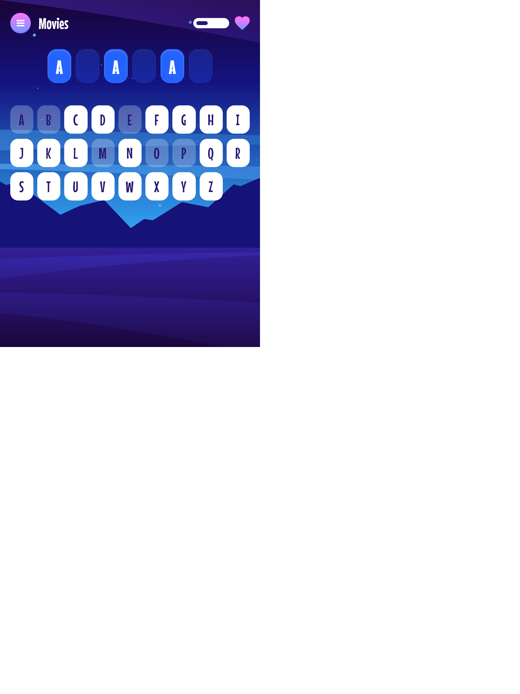

# Frontend Mentor - Hangman game solution

This is a solution to the [Hangman game challenge on Frontend Mentor](https://www.frontendmentor.io/challenges/hangman-game-rsQiSVLGWn). 
Frontend Mentor challenges help you improve your coding skills by building realistic projects. 

## Table of contents

- [Overview](#overview)
  - [The challenge](#the-challenge)
  - [Screenshot](#screenshot)
  - [Links](#links)
- [My process](#my-process)
  - [Built with](#built-with)
  - [What I learned](#what-i-learned)
- [Author](#author)

## Overview

### The challenge

Users should be able to:

- Learn how to play Hangman from the main menu.
- Start a game and choose a category.
- Play Hangman with a random word selected from that category.
- See their current health decrease based on incorrect letter guesses.
- Win the game if they complete the whole word.
- Lose the game if they make eight wrong guesses.
- Pause the game and choose to continue, pick a new category, or quit.
- View the optimal layout for the interface depending on their device's screen size.
- See hover and focus states for all interactive elements on the page.
- Navigate the entire game only using their keyboard.

### Screenshot

### Links

*// TODO*

- Solution URL: [Add solution URL here](https://your-solution-url.com)
- Live Site URL: [frontendmentor-hangman-game.netlify.app](https://frontendmentor-hangman-game.netlify.app/)

## My process

### Built with

- Semantic HTML5 markup
- Flexbox, CSS grid, custom box shadows
- Mobile-first workflow
- [Vue3](https://vuejs.org/) - The Progressive JavaScript Framework
- [Tailwind CSS](https://tailwindcss.com/) - A utility-first CSS framework packed with classes like flex, pt-4, text-center and rotate-90 that can be composed to build any design, directly in your markup.

### What I learned

Working on this challenge I learned how to make custom box shadows.

In this project I first time worked with [Storybook](https://storybook.js.org/) - a frontend workshop for building UI components and pages in isolation.

## Author

- Website - [Andrew](https://ap2.dev)
- Frontend Mentor - [@andreich1980](https://www.frontendmentor.io/profile/andreich1980)
